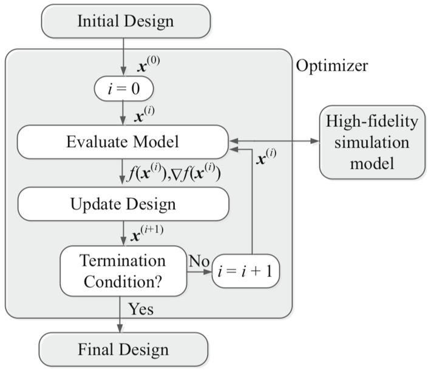
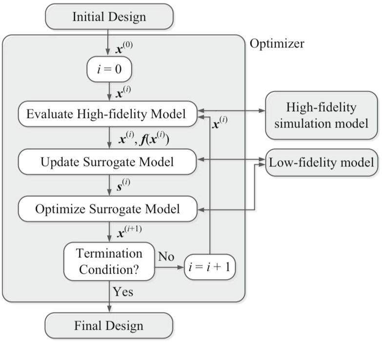

# SMBO_TeachingTool

SMBO_TeachingTool: A modular code for teaching Surrogate Modeling-Based Optimization.

This code is designed for students to understand basic concept of Surrogate Modeling-Based Optimization.

## Author

[Yong Hoon Lee](mailto:ylee196@illinois.edu) <br />
[Engineering System Design Laboratory](http://systemdesign.illinois.edu) (PI: Professor [James T. Allison](mailto:jtalliso@illinois.edu)), <br />
University of Illinois at Urbana-Champaign

## Prerequisites

* MATLAB with Optimization and Global Optimization Toolboxes
* (optional for plot export) Ghostscript

## How to execute

* Run "main_SMBO.m" Script

* Specify the problem name (= problem folder name) in the "prob" variable before run the script to solve a different problem.

  - Example (in "main_SMBO.m" file):
    ```MATLAB
    prob = 'AckleyFn';
    ```

## How to create a customized problem

* Create a folder with problem name (e.g., "MatyasFn").

* Create a MATLAB function file: "obj.m" in the created problem folder.

  - Example:
    ```MATLAB
    function f = obj(x)
        f = 0.26*(x(1)^2 + x(2)^2) - 0.48*x(1)*x(2);
    end
    ```

* Create a MATLAB function file: "conf.m" in the created problem folder.

  - Example:
    ```MATLAB
    function pc = conf()
        pc.nvar = 2;                % Number of variables
        pc.lb = [-10,-10];          % Lower bounds
        pc.ub = [5,5];              % Upper bounds
        pc.fs_g = 0.75;             % Shrink factor for global sample range
        pc.xtrue = [0,0];           % True soltuion in x (for comparison)
        pc.ftrue = 0;               % True solution in f (for comparison)
    end
    ```

# Course Material: Practical implementation of Surrogate modeling-based optimization

[Yong Hoon Lee](mailto:ylee196@Illinois.edu)

## References

* Wang, G. G. and Shan, S. (2006) Review of Metamodeling Techniques in Support of Engineering Design Optimization. J. Mech. Design 129:4, pp. 370-380. doi: [10.1115/1.2429697](https://dx.doi.org/10.1115/1.2429697)
* Koziel, S. and Leifsson, L. (2016) Introduction to Surrogate Modeling and Surrogate-Based Optimization. In: Simulation-Driven Design by Knowledge-Based Response Correction Techniques. Springer, Cham. pp. 31-61. doi: [10.1007/978-3-319-30115-0_4](https://dx.doi.org/10.1007/978-3-319-30115-0_4)
* Forrester, A., Sobester, A., Keane, A. (2008) Engineering Design via Surrogate Modelling: A Practical Guide. Wiley.
* Lee, Y. H. (2017) SMBO_TeachingTool: A modular code for teaching Surrogate Modeling-Based Optimization v1.5 (April 17, 2017). [https://github.com/yonghoonlee/SMBO_TeachingTool/releases](https://github.com/yonghoonlee/SMBO_TeachingTool/releases)

## Concept and flow of the SMBO tool

* Conventional Optimization

  <a href="https://www.codecogs.com/eqnedit.php?latex=\mathbf{x}^*=\underset{\mathbf{x}\in&space;R^n}{\arg\min}&space;U\left(\mathbf{f}\left(\mathbf{x}&space;\right&space;)&space;\right&space;)" target="_blank"></a>
    
  
    
  Koziel, S. and Leifsson, L. (2016)

* Surrogate-Based Optimization

  <a href="https://www.codecogs.com/eqnedit.php?latex=\mathbf{x}^{i&plus;1}=\underset{\mathbf{x}\in&space;R^n}{\text{argmin}}\;&space;U\left(\mathbf{s}^i\left(\mathbf{x}&space;\right&space;)&space;\right&space;)" target="_blank"></a>
    
  
    
  Koziel, S. and Leifsson, L. (2016)

> <a href="https://www.codecogs.com/eqnedit.php?latex=U" target="_blank"></a>: utility function, which is a scalar value
>
> <a href="https://www.codecogs.com/eqnedit.php?latex=\mathbf{f}" target="_blank"></a>: objective function, values could be a scalar or vector
>
> In this code, we are only looking at a single-objective optimization problem.
If the problem has multiple objective functions, the utility function can be formulated for the SMBO tool, which is developed for single-objective problem.

## Surrogate model construction flow


## Pseudo-code explaination with line numbers

```
While-loop: Adaptive surrogate modeling refinement (Line 94-177)
    Design Space Sampling (Line 97-124)
    High Fidelity Model Evaluation (Line 126-132)
    Surrogate Modeling-Based Optimization (Line 134-176)
        Compile results of (1) Current and (2) Previous iterations (Line 135-144)
        Surrogate-model construction / Surrogate-based optimization (Line 146-158)
    Error evaluation using high fidelity model (Line 160-172)
        Run high fidelity model evaluation for predicted optimum (Line 161-162)
        Save high fidelity function result at the predicted optimum (Line 164-166)
    Adjust sampling range for the next iteration (Line 174-176)
End while
```

*----------------README.md file not completed yet----------------*


### Sampling: Space-filling DoE (Line 97-124)

### High fidelity response of training points (Line 126-132)

### Compile results of current and previous iterations to construct surrogate model (Line 135-144)

### Surrogate-model construction / Surrogate-based optimization (Line 146-158)

#### Radial Basis Function

### Error evaluation using high fidelity model (Line 160-172)

### Adjust sampling range for the next iteration (Line 174-176)
